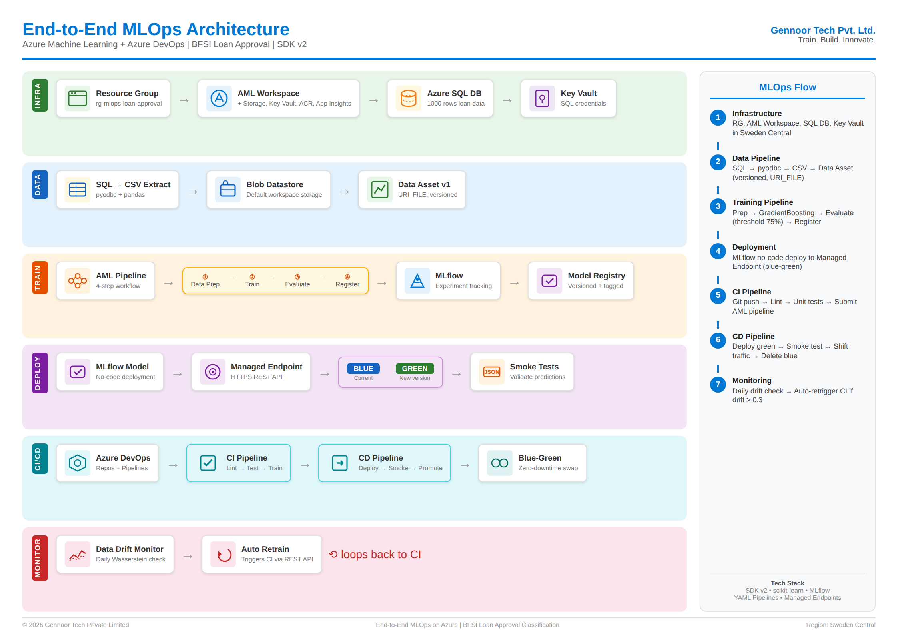

# End-to-End MLOps on Azure

**Azure Machine Learning + Azure DevOps | BFSI Loan Approval Classification**

Production-grade MLOps pipeline for a loan approval classification model using Azure ML SDK v2, scikit-learn, MLflow, YAML pipelines, and managed online endpoints.

> **Gennoor Tech Private Limited** | Train. Build. Innovate.

## Architecture



| Phase | Components | Azure Services |
|-------|-----------|----------------|
| Infrastructure | Resource Group, Workspace, SQL DB | Azure ML, Azure SQL, Key Vault |
| Data | Key Vault, Default Datastore, Data Asset | Azure SQL, Key Vault, AML Data Assets |
| Training | Pipeline: Prep > Train > Evaluate > Register | AML Pipelines, MLflow, Model Registry |
| Deployment | Managed Online Endpoint (blue/green) | AML Managed Endpoints |
| CI Pipeline | Lint > Test > Submit AML Pipeline | Azure DevOps Pipelines |
| CD Pipeline | Deploy Staging > Smoke Test > Promote | Azure DevOps + AML Endpoints |
| Monitoring | Data drift detection, automated retrain | AML Monitoring, DevOps REST API |

## Tech Stack

- **SDK**: Azure ML SDK v2 (`azure-ai-ml`)
- **ML Framework**: scikit-learn (GradientBoostingClassifier)
- **Experiment Tracking**: MLflow
- **CI/CD**: Azure DevOps YAML Pipelines
- **Deployment**: Managed Online Endpoints (Blue-Green)
- **Monitoring**: AML Data Drift Detection
- **Database**: Azure SQL (serverless)

## Repository Structure

```
mlops-loan-approval/
├── src/
│   ├── data_prep/
│   │   └── data_prep.py          # Data preparation component
│   ├── train/
│   │   └── train.py              # Model training component
│   ├── evaluate/
│   │   └── evaluate.py           # Model evaluation component
│   └── register/
│       └── register.py           # Model registration component
├── pipelines/
│   └── training_pipeline.py      # AML training pipeline definition
├── environments/
│   └── conda.yml                 # Conda environment for AML
├── tests/
│   └── test_data_prep.py         # Unit tests
├── data/                         # Local data directory (gitignored)
├── verify_workspace.py           # Lab 1: Verify AML workspace
├── populate_sql.py               # Lab 2: Create SQL table & insert data
├── verify_datastore.py           # Lab 3: Verify default datastore
├── create_data_asset.py          # Lab 4: Extract SQL data & register
├── deploy_endpoint.py            # Lab 7: Deploy to managed endpoint
├── test_endpoint.py              # Lab 7: Test the deployed endpoint
├── setup_monitoring.py           # Lab 11: Configure drift monitoring
├── retrain_trigger.py            # Lab 12: Automated retraining trigger
├── azure-pipelines-ci.yml        # Azure DevOps CI pipeline
├── azure-pipelines-cd.yml        # Azure DevOps CD pipeline
├── requirements.txt              # Python dependencies
└── README.md
```

## Prerequisites

- Active Azure subscription (Pay-As-You-Go or Enterprise)
- Owner or Contributor role on the subscription
- Azure CLI installed (version 2.50+)
- Python 3.9+ installed locally
- Visual Studio Code with Azure ML extension
- Git installed
- Azure DevOps organization (free tier is sufficient)
- ODBC Driver 18 for SQL Server

## Quick Start

### 1. Setup Environment
```bash
python -m venv .venv
source .venv/bin/activate  # or .venv\Scripts\activate on Windows
pip install -r requirements.txt
az extension add --name ml
az login --tenant <your-tenant-id>
```

### 2. Create Azure Resources (Phase 1)
```bash
az group create --name rg-mlops-loan-approval --location swedencentral
az ml workspace create --name mlw-loan-approval --resource-group rg-mlops-loan-approval --location swedencentral
python verify_workspace.py
python populate_sql.py
```

### 3. Configure Data (Phase 2)
```bash
python verify_datastore.py
python create_data_asset.py
```

### 4. Train Model (Phase 2-3)
```bash
python pipelines/training_pipeline.py
```

### 5. Deploy Model (Phase 3)
```bash
python deploy_endpoint.py
python test_endpoint.py
```

### 6. Setup CI/CD (Phase 4)
Configure Azure DevOps with the provided `azure-pipelines-ci.yml` and `azure-pipelines-cd.yml`.

### 7. Enable Monitoring (Phase 5)
```bash
python setup_monitoring.py
```

## Lab Guide

The complete step-by-step lab guide is available in `End-to-End-MLOps-Lab-Guide-Azure-DevOps-AML.docx`.

## Cleanup

```bash
az ml online-endpoint delete --name loan-approval-endpoint --resource-group rg-mlops-loan-approval --workspace-name mlw-loan-approval --yes --no-wait
az ml schedule delete --name loan-approval-monitor --resource-group rg-mlops-loan-approval --workspace-name mlw-loan-approval --yes
az group delete --name rg-mlops-loan-approval --yes --no-wait
```

## License

Copyright 2026 Gennoor Tech Private Limited. All rights reserved.
